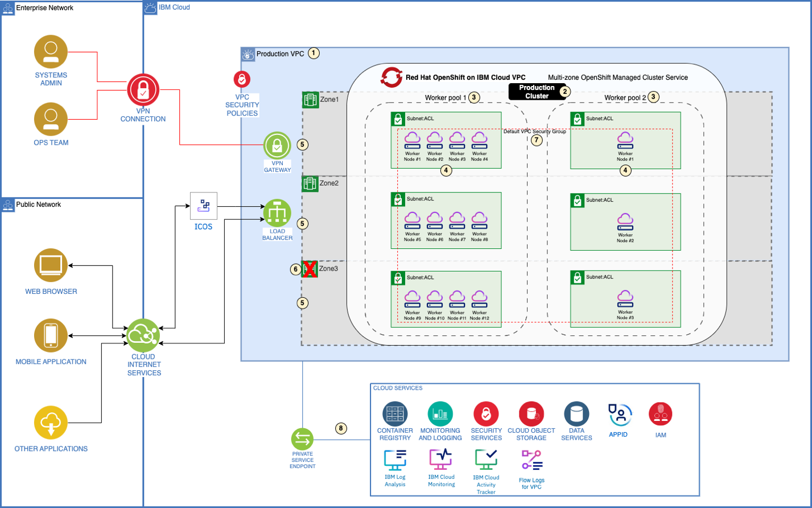

---
copyright:
  years: 2024
lastupdated: "2024-04-16"

subcollection: pattern-webapp-openshift-vpc

keywords:
---
{{site.data.keyword.attribute-definition-list}}

# Compute design
{: #compute-design}

1. A VPC Landing Zone is deployed which provides the ability to automate the install of an OpenShift cluster into a multizone region.
2. Three separate clusters are created for the production, pre-production and dev/test environments (diagram shows production cluster only).
3. Separate worker pools are created within the clusters for the application and storage workloads.
4. Worker pool node size and quantity are determined based on the resource requirements for the application and storage workloads.
5. To meet the OpenShift on VPC service availability SLA of 99.99% a minimum of 6 worker nodes are equally distributed across three availability zones.
6. Total worker node capacity is sized at 150% of the total workload's required capacity, so that if one zone goes down resources are available to maintain the workload.
7. By default, the cluster is provisioned with a VPC security group and a cluster-level security group.
8. The OpenShift platform is integrated with IBM Cloud Services to provide centralized cluster observability services.

**Capacity planning for your Red Hat OpenShift cluster**

It is important to plan for the expected capacity of the Red Hat OpenShift deployment to ensure proper infrastructure sizing and resource availability.

The capacity planning should address current needs and future growth. Worker nodes in a worker pool can easily be added and removed in response to changing workload demands. The capacity change process can be automated by leveraging [autoscaling](https://cloud.ibm.com/docs/openshift?topic=openshift-cluster-scaling-classic-vpc) for the VPC cluster.

The cluster-autoscaler add-on can scale the worker pools in the VPC cluster automatically to increase or decrease the number of worker nodes in the worker pool based on the sizing needs of scheduled workloads.

When determining worker node and cluster sizing and deployment strategy consider the following workload requirements and enterprise business needs:

The infrastructure view including compute (CPU, memory and disk capacity), storage and network requirements.

Service, usability and application view which can include middleware, databases, applications, data persistency and high availability.

Workload behavior patterns and forecasts can include: seasonal peaks for workloads, and event-driven increases such as market campaigns, mergers and acquisitions, and new project deployment.

Consider Service Level Agreements (SLAs), high availability, resiliency and disaster recovery requirements

**Sizing your Red Hat OpenShift cluster environment**

**Determining the Number of Clusters Required**

- The number of ROKS clusters is decided based on the number of environments.
- For this use case, we have 3 environments. Dev/Test, Pre-Production, and Production. So, the decision is to have 3 ROKS clusters.
  - 1 for Dev/Test environment separated by Red Hat OpenShift projects. Merging non-production into a single cluster is valid in any scenario where a reduction in the infrastructure/management cost is required.
  - 1 for Pre-Production Environment.
  - 1 for the Production environment.

**Determine the workload resource requirements for your environments**

The following general resource consumption guidance for common microservice workloads can also be considered:

- Node.js – 1.5 to 2.5 vCPU average consumption per prod application with an average TPS of 1000 and three replicas.
- Java – 2.5 to 4.5 vCPU average consumption per prod application with an average TPS of 1000 and three replicas.

NOTE: For any additional workloads like the integrated services, OEM services, and add-on workloads require additional cluster resources. The sizing needs to be planned by working with the third-party vendor and accounted for in the cluster capacity planning.

Additionally, for stateful applications with shared or persistent storage needs, consider the worker pool requirements for software defined storage (SDS) solution such as [Portworx](https://cloud.ibm.com/docs/openshift?topic=openshift-storage_portworx_about) or [OpenShift Data Foundation](https://cloud.ibm.com/docs/openshift?topic=openshift-ocs-storage-prep). An SDS solution abstracts storage devices of various types, sizes, or from different vendors that are attached to the worker nodes in your cluster.

The level of availability set up for the cluster impacts coverage under the [IBM Cloud HA service level agreement terms](https://cloud.ibm.com/docs/overview?topic=overview-slas).

**Sizing the HomeDIY Ltd use case Red Hat OpenShift cluster environment**

In sizing the clusters for the HomeDIY use case use the following steps:

1. **Determine the workload partitioning strategy and required number of clusters.**
   For this use case four environments are in scope and will be separated within three OpenShift Clusters based on the customer stated business requirements and best practices for environment isolation:
      - Production Cluster
      - Pre-Prod Cluster (assumed @ 100% of production resources)
        1. The Pre-Production cluster is being used for load performance testing and needs to mirror the production cluster.
      - Non-Production Cluster:
        1. The non-production environments are being consolidated within a single cluster for operational efficiency and are being isolated within separate namespaces to define specific user access and roles.
        2. User Acceptance Testing (assumed @ 50% of production resources)
        3. Development (assumed @ 25% of production resources)

           **Use Case Sizing Decision:**

- Three OpenShift clusters: (1) Production, (2) Pre-Prod and (3) Dev/Test

2. **Determine the workload resource requirements for environments.**
   1. Calculate the resource requirements for the in-scope environments based on the average transactions per second expected in production for the E-commerce application solution.
   2. There are 20 microservices supporting a web (average API load of 750 Transactions Per Second(TPS) and mobile (average API load of 1000 TPS) channel.
   3. A typical Node.js application with three replicas averaging 1750 TPS can minimally be expected to consume between 2.5 and 4.5 vCPU as a baseline estimate. The sizing exercise assumes an average utilization of 3.5 vCPU per Node.js application with three replicas.

      **Use Case Sizing Decision:**

- Production Cluster: 70 vCPU required (20 microservices x 3.5 vCPU)
- Pre-Prod Cluster: Match to Production
- Non-Prod Cluster: 53 vCPU (@ 50% of prod = 35 vCPU; DEV @ 25% of prod = 18 vCPU). For the non-production environments, assumptions are single replicas with minimal transaction loads.

3. **Determine additional services included within the cluster.**
   1. Additional services will be running within the clusters such as OpenShift Service Mesh and IBM Cloud Monitoring agents. For the sizing estimation assume adding 10% to the E-commerce application worker pool.

      **Use Case Sizing Decision (compute worker pool):**

- Production Cluster: 77 vCPU required (70 vCPU \* 1.1)
- Pre-Prod Cluster: Match to Production
- Cluster: 58 vCPU (53 vCPU \* 1.1)

1. One of the client requirements for the solution is highly available persistent storage. There are stateful applications and a containerized Redis database is being used for event store and message queue purposes.
2. To meet this requirement the IBM Cloud [Portworx Enterprise](https://cloud.ibm.com/catalog/services/portworx-enterprise) service will be utilized which will provide a software defined storage solution for the E-commerce workload and a separate worker pool will be used for the storage nodes. This will allow for disaggregated scaling of the E-commerce worker nodes to meet demand changes and will be provisioned for each cluster.
3. For highly available data storage, Portworx requires at least 3 worker nodes with raw and unformatted block storage.

   **Use Case Sizing Decision (storage worker pool):**

- A separate storage worker pool of three 4 vCPU x 16 GB memory worker nodes is added to the three OpenShift clusters.
- *Note: The worker node sizing represents a minimum worker node flavor for Portworx and specific deployment strategy and sizing is not considered under this pattern.*

4. **Determine the optimal worker node size and quantity for the E-commerce worker pool.**
   1. For cost and management optimization we are choosing 16 vCPU x 64 GB flavor worker nodes.
   2. For pod scheduling and performance considerations we are limiting the resource available to the application workload to 75% of the work node vCPU capacity.

      **Use Case Sizing Decision:**

- Production Cluster: Seven 16 vCPU x 64 GB worker nodes (16 vCPU (node capacity) \* .75 (reserve capacity) = 12 vCPU. 77 vCPU (compute workload resource requirement) / 12 = 7 (worker nodes rounded up)
- Pre-Prod Cluster: Match to Production
- Non-Production Cluster: Five 16 vCPU x 64 GB worker nodes (16 vCPU (node capacity) \* .75 (reserve capacity) = 12 vCPU. 58 vCPU (compute workload resource requirement) / 12 = 5 (worker nodes rounded up)

5. **Determine your cluster sizing accounting for resiliency requirements including high availability and SLA targets.**
   1. For resiliency we are planning for the total capacity of the production and pre-prod clusters to be at least 150% of the total workload's required capacity, so that if one zone goes down, we have resources available to maintain the workload.
   2. The client availability requirements for the Red Hat OpenShift service availability are 99.99% which requires our production cluster to have a minimum of 6 worker nodes in a multizone cluster across three availability zones (two worker nodes per AZ). This provides for high availability for the application replicas within an availability zone as well as regionally.

      **Use Case Sizing Decision:**

- Production Cluster: Twelve 16 vCPU x 64 GB worker nodes (7 worker nodes \* 1.5 = 11 and 12 are required to equally distribute across 3 AZs)
- Pre-Prod Cluster: Match to Production
- Non-Production Cluster: Six 16 vCPU x 64 GB worker nodes (5 worker nodes and 6 are required to equally distribute across 3 AZs)
- *Note: A minimum of 6 worker nodes equally distributed across three availability zones is required to meet the Cloud Service Level Agreement of 99.99% for Tier 3 (High Availability) and for the HomeDIY availability SLA requirement to be met.*

6. **Putting it all together: Final cluster sizing**

| **Cluster & Role** | **Component** | **\# of WNs** | **Worker Node Flavor** | **Cluster Type & Config** |
| ------------------------ | ------------------- | ------------------- | ---------------------------- | ------------------------------- |
| 1 - Production           | Compute Worker Pool | 12                  | 16 vCPU x 64 GB Memory       | Multizone – 4 nodes per AZ     |
|                          | Storage Worker Pool | 3                   | 4 vCPU x 16 GB Memory        | Multizone – 1 node per AZ      |
| 2 - Pre-Prod             | Compute Worker Pool |                     | Match to Production          | Match to Production             |
|                          | Storage Worker Pool |                     | Match to Production          | Match to Production             |
| 3 - Non-Prod             | Compute Worker Pool | 6                   | 16 vCPU x 64 GB Memory       | Multizone – 2 nodes per AZ     |
|                          | Storage Worker Pool | 3                   | 4 vCPU x 16 GB Memory        | Multizone – 1 node per AZ      |

1. Cluster \# 1 (Production):

   - Separate worker pools for E-commerce application workload and the software defined storage layer

   1. Cluster \#2 (Pre-Prod) Match to Production
   2. Cluster \#3 (Non-Production):
      - Single cluster for UAT and Dev environments separated by Project/Namespace
      - Separate worker pools for E-commerce application workload and the software defined storage layer
