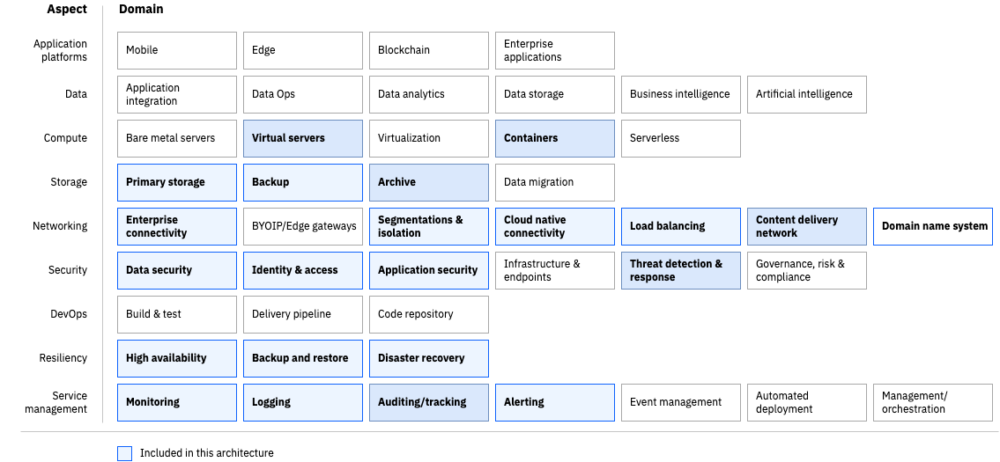

---
copyright:
  years: 2024
lastupdated: "2024-04-20"

subcollection: pattern-webapp-openshift-vpc

keywords:
# The release that the reference architecture describes

authors:
- name: Joe Kiernan, Sivarajan Ravisankar, Adam Geiger, Rob Tallotta, Gobinda Sahaa, David Long.
---
# Web-application on OpenShift on VPC

## Architecture diagram
{: #architecture-diagram}

{: caption="Figure 1. Reference architecture for web application deployment" caption-side="bottom"}

Figure 1 Reference Architecture for cluster design of E-commerce microservices solution

## Design scope
{: #design-scope}

Following the [Architecture Framework](https://test.cloud.ibm.com/docs-draft/architecture-framework?topic=architecture-framework-taxonomy), RedHat OpenShift on VPC covers design considerations and architecture decisions for the following aspects and domains:

- **Compute:** Bare Metal and Virtual infrastructure
- **Storage:** Primary, Backup, Archive and Migration
- **Networking:** Enterprise Connectivity, Edge Gateways, Segmentation and Isolation, Cloud Native Connectivity and Load Balancing
- **Security:** Data, Identity and Access Management, Infrastructure and Endpoint, Threat Detection and Response
- **Resiliency:** Backup and Restore, Disaster Recovery, High Availability
- **Service Management:** Monitoring, Logging, Alerting, Management/Orchestration

The Architecture Framework, described in [Introduction to the Architecture Framework](https://cloud.ibm.com/docs/architecture-framework?topic=architecture-framework-intro), provides a consistent approach to design cloud solutions by addressing requirements across a pre-defined set of aspects and domains, which are technology-agnostic architectural areas that need to be considered for any enterprise solution. It can be used as a guide to make the necessary design and component choices to ensure you have considered applicable requirements for each aspect and domain. After you have identified the applicable requirements and domains that are in scope, you can evaluate and select the best fit for purpose components for your enterprise cloud solution.

Following the Architecture Framework, the web application on openshift vpc covers design considerations and architecture decisions for the following aspects and domains:

{: caption="Figure 2. RedHat OpenShift on VPC cluster design scope" caption-side="bottom"}

## Components

| **Aspect**             | **Component**                                                                                                                                                                                      | **How the component is used**                                                                                                                                                                                                                                                                                                                                                                                                                                                                                                                                                                                                                                      |
| ---------------------------- | -------------------------------------------------------------------------------------------------------------------------------------------------------------------------------------------------------- | ------------------------------------------------------------------------------------------------------------------------------------------------------------------------------------------------------------------------------------------------------------------------------------------------------------------------------------------------------------------------------------------------------------------------------------------------------------------------------------------------------------------------------------------------------------------------------------------------------------------------------------------------------------------------ |
| Compute                      | [Red Hat OpenShift on VPC](https://cloud.ibm.com/kubernetes/catalog/create?platformType=openshift&catalog_query=aHR0cHM6Ly9jbG91ZC5pYm0uY29tL2NhdGFsb2c%2Fc2VhcmNoPW9wZW5zaGlmdCNzZWFyY2hfcmVzdWx0cw%3D%3D) | Container platform with worker nodes to support the web, app, and database server instances                                                                                                                                                                                                                                                                                                                                                                                                                                                                                                                                                                              |
|                              | [Cluster autoscaler](https://cloud.ibm.com/docs/openshift?topic=openshift-cluster-scaling-classic-vpc)                                                                                                      | Scale the worker pools in the clusters to meet demand                                                                                                                                                                                                                                                                                                                                                                                                                                                                                                                                                                                                                    |
| **Resiliency**         | [Red Hat OpenShift on VPC](https://cloud.ibm.com/kubernetes/catalog/create?platformType=openshift&catalog_query=aHR0cHM6Ly9jbG91ZC5pYm0uY29tL2NhdGFsb2c%2Fc2VhcmNoPW9wZW5zaGlmdCNzZWFyY2hfcmVzdWx0cw%3D%3D) | Multizone clusters across 3 availability zones in a single region                                                                                                                                                                                                                                                                                                                                                                                                                                                                                                                                                                                                        |
|                              | [Portworx SDS](https://cloud.ibm.com/docs/openshift?topic=openshift-storage_portworx_about) with Block Storage                                                                                              | Highly available through volume replication across availability-zones (datacenters) in a region. Also, able to perform backups                                                                                                                                                                                                                                                                                                                                                                                                                                                                                                                                           |
|                              |                                                                                                                                                                                                          |                                                                                                                                                                                                                                                                                                                                                                                                                                                                                                                                                                                                                                                                          |
|                              |                                                                                                                                                                                                          |                                                                                                                                                                                                                                                                                                                                                                                                                                                                                                                                                                                                                                                                          |
|                              | IBM Cloud Database                                                                                                                                                                                       | Provisioned within Multi-Zone-Region (MZR) with replication/backup enabled based on database.                                                                                                                                                                                                                                                                                                                                                                                                                                                                                                                                                                            |
|                              | [Cloud Object Storage](https://cloud.ibm.com/docs/cloud-object-storage?topic=cloud-object-storage-getting-started-cloud-object-storage)                                                                     | Regional bucket: Buckets that are created at a regional endpoint distribute data across three data centers that are spread across a metro area. Any one of these data centers can suffer an outage or even destruction without impacting availability. Used for storing of static content along with logs needed for long term storage. Cross-geo: Buckets that are created at a cross-region endpoint distribute data across three regions in a geographical location. Any one of these regions can suffer an outage or even destruction without impacting availability. Used to store volume snapshots/backup of the VPC Block Storage for disaster recovery purposes. |
| Storage                      | [Cloud Object Storage](https://cloud.ibm.com/docs/cloud-object-storage?topic=cloud-object-storage-getting-started-cloud-object-storage)                                                                     | Eventual consistent, highly available storage for static content, backups, logs for short and long-term retention (application, operational, and audit logs)                                                                                                                                                                                                                                                                                                                                                                                                                                                                                                             |
|                              | [IBM Cloud Databases](https://www.ibm.com/cloud/databases)                                                                                                                                                  | The IBM Cloud Databases component provides storage solutions for various databases, for this use case we use**PostgreSQL.**                                                                                                                                                                                                                                                                                                                                                                                                                                                                                                                                        |
|                              | [Portworx SDS](https://cloud.ibm.com/docs/openshift?topic=openshift-storage_portworx_about) with Block Storage                                                                                              | An SDS solution abstracts storage devices of VPC Block storage.                                                                                                                                                                                                                                                                                                                                                                                                                                                                                                                                                                                                          |
|                              | [Activity Tracker Event Routing](https://cloud.ibm.com/docs/atracker?topic=atracker-about)                                                                                                                  | Audit logs                                                                                                                                                                                                                                                                                                                                                                                                                                                                                                                                                                                                                                                               |
| Networking                   | Virtual private Cloud (VPC)                                                                                                                                                                              | Isolation of business and data access layer workloads within private network segmentation.                                                                                                                                                                                                                                                                                                                                                                                                                                                                                                                                                                               |
|                              | [VPC Virtual Private Network (VPN)](https://test.cloud.ibm.com/docs-draft/iaas-vpn?topic=iaas-vpn-getting-started)                                                                                          | Remote access to manage IBM Cloud resources in a private network by the operations team.                                                                                                                                                                                                                                                                                                                                                                                                                                                                                                                                                                                 |
|                              | Virtual Private Endpoint (VPE)                                                                                                                                                                           | For private network access to Cloud Services within the cloud’s backbone networking, for example, Key Protect, Cloud Object Storage, and so on.                                                                                                                                                                                                                                                                                                                                                                                                                                                                                                                         |
|                              | [VPC Load Balancers](https://test.cloud.ibm.com/docs-draft/vpc?topic=vpc-load-balancers)                                                                                                                    | Application Load Balancing for the workloads running on ROKS cluster where its worker nodes spread across multiple AZs.                                                                                                                                                                                                                                                                                                                                                                                                                                                                                                                                                  |
|                              | [Cloud Internet Services (CIS)](https://test.cloud.ibm.com/docs-draft/cis?topic=cis-getting-started)                                                                                                        | Public Load balancing of web traffic with DDoS and CDN capability to serve low latency static content.                                                                                                                                                                                                                                                                                                                                                                                                                                                                                                                                                                   |
|                              | Network ACLs                                                                                                                                                                                             | Network ACLs consist of a set of rules that specify conditions for allowing or denying traffic. By default, if a packet does not match any rule in the ACL, it is implicitly denied. Rules are processed in order, and the first matching rule is applied. These are stateless, meaning they do not keep track of the state of connections.                                                                                                                                                                                                                                                                                                                              |
|                              | Red Hat OpenShift Service Mesh                                                                                                                                                                           | Configures the routing and security policies, which enhances observability, security, and management for the microservices.                                                                                                                                                                                                                                                                                                                                                                                                                                                                                                                                              |
|                              | Red Hat OpenShift Network Policies                                                                                                                                                                       | Network policies provide a way to control and secure the communication between pods in a ROKS cluster. These policies can be applied on ‘PodSelector’ and ‘NamespaceSelector’ to define rules based on pod or namespace characteristics.                                                                                                                                                                                                                                                                                                                                                                                                                             |
| Security                     | IBM Cloud IAM                                                                                                                                                                                            | Provides IBM Cloud admin to securely authenticate users for platform services and control access to resources consistently across IBM Cloud.                                                                                                                                                                                                                                                                                                                                                                                                                                                                                                                             |
|                              | Bastion Host on VSI                                                                                                                                                                                      | Provides secure restricted internet access from Production for middleware and OpenShift operator software                                                                                                                                                                                                                                                                                                                                                                                                                                                                                                                                                                |
|                              | VPC security groups                                                                                                                                                                                      | Provides set of rules allowing network traffic to enter or leave a resource creating a desired stateful network pattern.                                                                                                                                                                                                                                                                                                                                                                                                                                                                                                                                                 |
|                              | Cloud Internet Services (CIS)                                                                                                                                                                            | DDoS protection and Web App Firewall (WAF).                                                                                                                                                                                                                                                                                                                                                                                                                                                                                                                                                                                                                              |
|                              | Key Protect                                                                                                                                                                                              | Hardware security module (HSM) and Key Management Service                                                                                                                                                                                                                                                                                                                                                                                                                                                                                                                                                                                                                |
|                              | Secrets Manager                                                                                                                                                                                          | Certificate and Secrets Management                                                                                                                                                                                                                                                                                                                                                                                                                                                                                                                                                                                                                                       |
|                              | Resource Group                                                                                                                                                                                           | Use resource groups to organize the cloud account resources for access control (though IAM) and billing (costs) purposes.                                                                                                                                                                                                                                                                                                                                                                                                                                                                                                                                                |
|                              | ROKS RBAC                                                                                                                                                                                                | Provides role-based access control to objects within the Openshift Cluster used to determine whether a user is allowed to perform a given action within a project (namespace).                                                                                                                                                                                                                                                                                                                                                                                                                                                                                           |
|                              | IBM Cloud Container Registry                                                                                                                                                                             | Provides highly available private repository for signed images and Vulnerability Advisor for vulnerability scanning of images.                                                                                                                                                                                                                                                                                                                                                                                                                                                                                                                                           |
| **Service Management** | IBM Cloud Monitoring                                                                                                                                                                                     | IBM Cloud Monitoring collects and monitors operational metrics for cloud infrastructure as well as the cloud platform and services and provides a single view for all metrics                                                                                                                                                                                                                                                                                                                                                                                                                                                                                            |
|                              | IBM Cloud Logging                                                                                                                                                                                        | IBM Cloud Logging collects operational logs from applications, platform resources, and infrastructure and provides interfaces to view and analyze all logs.                                                                                                                                                                                                                                                                                                                                                                                                                                                                                                              |
|                              | IBM Cloud Alerting                                                                                                                                                                                       | IBM Cloud Alerting used to set up alerts, monitor storage resources, and trigger notifications in real-time, allowing administrators to proactively address issues and optimize resource utilization of storage, database, and related services with auto scaling features.                                                                                                                                                                                                                                                                                                                                                                                              |

Table 1. *E-commerce microservices components*

The following microservices will be designed and built on RedHat OpenShift on VPC. For this sample architecture, assume 20 Node.js microservices are in scope with the volumetrics as below

## Requirements

The following represents a baseline set of requirements that are applicable to most clients and critical to a successful Red Hat OpenShift on VPC cluster design deployment.

| **Aspect**   | **Requirement**                                                                                                                                                                                                                                                                                                                                                                                                                                                                                                                                                                                                                                                                                                                                                                                                                                                                                                                                                                                                                                                                                                                                                                                                                                                                                                                                                                                                                                                                                                                                                                                                                                                                            |  |
| ------------------ | ------------------------------------------------------------------------------------------------------------------------------------------------------------------------------------------------------------------------------------------------------------------------------------------------------------------------------------------------------------------------------------------------------------------------------------------------------------------------------------------------------------------------------------------------------------------------------------------------------------------------------------------------------------------------------------------------------------------------------------------------------------------------------------------------------------------------------------------------------------------------------------------------------------------------------------------------------------------------------------------------------------------------------------------------------------------------------------------------------------------------------------------------------------------------------------------------------------------------------------------------------------------------------------------------------------------------------------------------------------------------------------------------------------------------------------------------------------------------------------------------------------------------------------------------------------------------------------------------------------------------------------------------------------------------------------------------ | - |
| Compute            | Provide appropriate levels of and memory to match the workloads of the E-commerce solution as described in the non-functional requirements section. The solution requires a managed container platform.                                                                                                                                                                                                                                                                                                                                                                                                                                                                                                                                                                                                                                                                                                                                                                                                                                                                                                                                                                                                                                                                                                                                                                                                                                                                                                                                                                                                                                                                                          |  |
| Network            | Establish clear network segmentation between public-facing components and backend systems, enforcing strict access controls and reducing the attack surface. Provide network isolation with the ability to separate applications based on attributes such as data classification, public (Internet facing) versus internal services and business functions. Network connectivity to IBM Cloud data centers to provide access to monitor & manage the application’s IaaS/PaaS from the customer’s premise to the operations teams. Ensure low latency and high throughput to deliver a seamless shopping experience, minimizing page load times and providing swift access to content across geographical locations. The E-Commerce application should deliver web content, such as images, videos, scripts and other assets with improved performance, reliability, and scalability to geographically distributed users. The components of the E-Commerce application are broken down into smaller, independent services that leverages cloud services which enhances connectivity, scalability, and resilience. Each service can be developed, deployed, and scaled independently. Managing the complexity of communication between each service providing features like load balancing, tracing, and monitoring. Implement redundancy measures (e.g., multiple data centers, server clusters) to ensure continuous service availability, with failover mechanisms in place to mitigate downtime. Ensure robust security measures, including firewalls, intrusion detection and prevention systems, and encryption protocols, to protect data in transitaintain the integrity of the network. |  |
| Storage            | Utilize high-performance storage solutions. Employ caching mechanisms to reduce latency for frequently accessed data. Implement workload optimization techniques to ensure efficient resource utilization. Utilize containerized architecture such as OpenShift to easily scale resources horizontally. Implement auto-scaling mechanisms to automatically adjust resources based on workload demands. Utilize cloud-native database solutions that support horizontal scaling. Configure multi-zone or multi-region replication for data redundancy and failover capabilities. Implement automated failover mechanisms to minimize downtime in case of failures.                                                                                                                                                                                                                                                                                                                                                                                                                                                                                                                                                                                                                                                                                                                                                                                                                                                                                                                                                                                                                                |  |
| Resiliency         | The E-Commerce application should deliver web content, such as images, videos, scripts and other assets with improved performance, reliability, and scalability to geographically distributed users. The solution must be highly available and meet a 99.99% Service Level Agreement standard. Implement automated, schedule-based backup solutions for capturing persistent volumes, configurations, and data across the entire OpenShift cluster. Enable customizable backup frequencies aligned with different application RPO requirements. Utilize IBM Clouds highly available storage options for storing backup data. Ensure backup data replication across multiple geographic locations to enhance data durability and availability. Implement cross-region or multi-zone storage replication for data availability during zone or region failure. Develop a comprehensive disaster recovery plan outlining steps for application and data recovery to minimize downtime and data loss, meeting RTO and RPO requirements.                                                                                                                                                                                                                                                                                                                                                                                                                                                                                                                                                                                                                                                               |  |
| Security           | Provide data encryption at rest with worker node disk encryption. Provide secure data in transit using SSL/TLS certificates Provide IAM Services for platform operations, developers, application users, service accounts and cloud administrators. Provide restricted internet access from Production to enable middleware or operator updates Provide sec access cloud resources Provide private repository for signed images with image vulnerability scans. Firewalls must be restrictively configured to provide advanced security features and prevent all traffic, both inbound and outbound, except that which is specifically required, documented, and approved and include IPS/IDS services Provide for segregation of duties that developers do not have access to production. Provide for isolation between Production and Nonproduction environments.                                                                                                                                                                                                                                                                                                                                                                                                                                                                                                                                                                                                                                                                                                                                                                                                                              |  |
| Service management | The solution will provide performance tuning capabilities and integrate with cloud monitoring services to ensure SLA’s and end user experience is optimized. Implement real-time monitoring tools for storage performance, resource utilization, and operational health, integrating with IBM Cloud Monitoring. Deploy a logging solution to capture and store logs from storage nodes, pods, and containers, including data access logs, system events, and error logs, integrating with IBM Cloud Log Analysis. Establish a proactive alerting mechanism to notify administrators of critical issues, potential bottlenecks, or system failures, integrating with IBM Cloud Event Management for customizable thresholds and incident escalation paths.                                                                                                                                                                                                                                                                                                                                                                                                                                                                                                                                                                                                                                                                                                                                                                                                                                                                                                                                       |  |
|                    |                                                                                                                                                                                                                                                                                                                                                                                                                                                                                                                                                                                                                                                                                                                                                                                                                                                                                                                                                                                                                                                                                                                                                                                                                                                                                                                                                                                                                                                                                                                                                                                                                                                                                                  |  |
| Other requirements | Client wants to migrate and modernize their E-commerce solution from traditional to microservices based architecture.                                                                                                                                                                                                                                                                                                                                                                                                                                                                                                                                                                                                                                                                                                                                                                                                                                                                                                                                                                                                                                                                                                                                                                                                                                                                                                                                                                                                                                                                                                                                                                            |  |

Table 1. *E-commerce microservices cluster design requirements*
