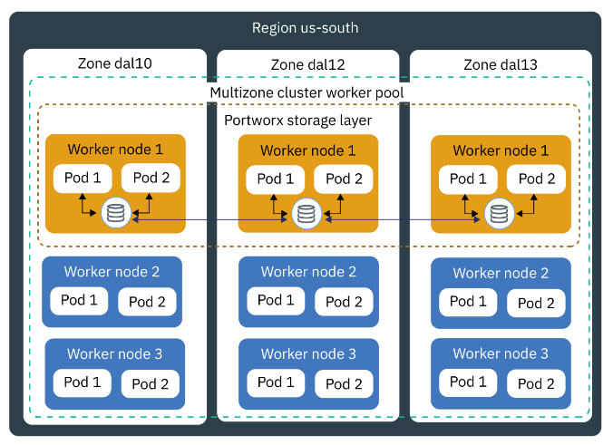

---
copyright:
  years: 2024
lastupdated: "2024-04-11"

subcollection: 

keywords:
---
{{site.data.keyword.attribute-definition-list}}

# Storage design

{: #storage-design}

We will provide an in-depth view of the different storage types and solutions available and then make an architecture decision that best fits E-commerce HomeDIY Ltd use case.

Storage Types and Overview:

**IBM Cloud Block Storage:**

**IBM Cloud Block Storage** on Kubernetes offers persistent storage for containerized applications, ensuring data durability and scalability. It seamlessly integrates with Kubernetes clusters, providing dynamic provisioning, snapshots, and encryption. This enables efficient management and utilization of storage resources within the Kubernetes environment, enhancing application performance and reliability.

For more information, see [Block Storage for VPC documentation](https://cloud.ibm.com/docs/openshift?topic=openshift-vpc-block).

**Use Cases:**

**Stateful Applications:** The IBM Cloud Block Storage is ideal for deploying stateful applications like databases (e.g., MySQL, PostgreSQL) in Kubernetes clusters.

**Data Analytics Workloads:** When running data analytics workloads, you often need to process and store large volumes of data.

**IBM Cloud Object Storage:**

**IBM Cloud's Object Storage** plugin optimizes Kubernetes for seamless data management with IBM Cloud Object Storage. Leveraging IBM's robust storage service, it simplifies integration with cloud-native apps, offering distributed, geo-redundant storage. This pattern caters efficiently to diverse Kubernetes storage needs, enabling effortless provisioning, management, and dynamic resource allocation, streamlining administration. This type of storage volume is not suitable for write-intensive workloads, random write operations, incremental data updates, or transaction databases.

For more information surrounding IBM Cloud Object Storage, see the following [documentation](https://cloud.ibm.com/docs/openshift?topic=openshift-storage-cos-understand).

**Use Cases:**

1. **Data Backup and Archival:** IBM Cloud Object Storage facilitates data backup and archival, crucial for scenarios like Kubernetes-based e-commerce apps. Automated backups ensure data durability and quick recovery.
2. **Media Storage for Content Delivery:** Content delivery applications, such as video streaming platforms, require efficient and scalable media storage. With the IBM Cloud Object Storage pattern, you can store media assets like videos, images, and audio files. When a user requests media content, Kubernetes can retrieve it from IBM Cloud Object Storage and deliver it seamlessly to the user, ensuring a smooth streaming experience.
3. **Cross-Region Data Replication:** IBM Cloud Object Storage supports cross-region data replication, essential for global businesses ensuring data redundancy and disaster recovery. Data synchronization between Kubernetes clusters minimizes downtime in case of regional failures.

**IBM Cloud Databases:**

**IBM Cloud Databases** simplifies storage deployment on IBM Cloud's OpenShift environment, leveraging its services for seamless experiences in provisioning, scaling, and maintenance. Supporting PostgreSQL, MySQL, Redis, and MongoDB, it offers automated backups, high availability, and security, enabling focus on applications rather than infrastructure.

For more information on IBM Cloud databases, see the following [documentation](https://www.ibm.com/cloud/databases).

**Use Cases:**

1. **Microservices Applications:** IBM Cloud Databases suits microservices apps, providing isolated databases for each microservice. For instance, in e-commerce, deploy separate PostgreSQL databases for user accounts, products, and orders, ensuring data isolation, scalability, and fault tolerance.
2. **Scalable Web Applications:** IBM Cloud Databases automatically scales for variable web app traffic. For example, during flash sales, Kubernetes scales the database to handle increased traffic.

**Software-defined storage (SDS) solution :**

**Portworx :**

**Portworx** is a software-defined storage (SDS) solution that transforms commodity hardware into a robust storage cluster. Portworx provides a high available software-defined storage solution to be used for the local persistent storage for the containerized stateful application across multiple zones for this solution. Due to its rich feature set and stability, Portworx was selected over other storage solutions like ODF and Ceph. Instead of having to manually define hooks and other configurations like ODF with OADP for backups, Portworx can work with such applications out of the box. As ODF with OADP matures, it will gain the features and stability that Portworx currently has.

For more information, see the following [Portworx documentation](https://cloud.ibm.com/docs/openshift?topic=openshift-storage_portworx_about).

**Portworx provisioned in a multizone cluster**

**Use Cases:**

1. **Database Storage:** Enterprises running databases like PostgreSQL or MongoDB on Kubernetes can leverage Portworx for high-performance and resilient storage. For instance, a financial services company can use Portworx to ensure that their database workloads are always available and can be scaled up or down based on demand without any data loss.
2. **Hybrid and Multi-Cloud Deployments:** Organizations can use Portworx for seamless data mobility across different cloud environments. For example, a retail company could deploy their Kubernetes clusters in both IBM Cloud and another cloud provider, using Portworx for consistent and secure data access across these platforms.
3. **Disaster Recovery:** Portworx facilitates efficient disaster recovery strategies. An e-commerce platform can use Portworx to replicate data across multiple regions, ensuring that in the event of a regional outage, their services remain uninterrupted.

Another very useful software-defined storage (SDS) solution is **OpenShift Data Foundation (ODF).**

**OpenShift Data Foundation (ODF)**, although not chosen for this particular deployment, is a promising solution in its own right. As it evolves, it is anticipated to provide similar benefits to Portworx, including high availability and software-defined storage capabilities. With ODF's continued development, it is likely to offer easier integration with monitoring, logging, and encryption tools, streamlining the deployment process further.

For more information, see [OpenShift Data Foundation documentation](https://cloud.ibm.com/docs/openshift?topic=openshift-ocs-storage-prep).
