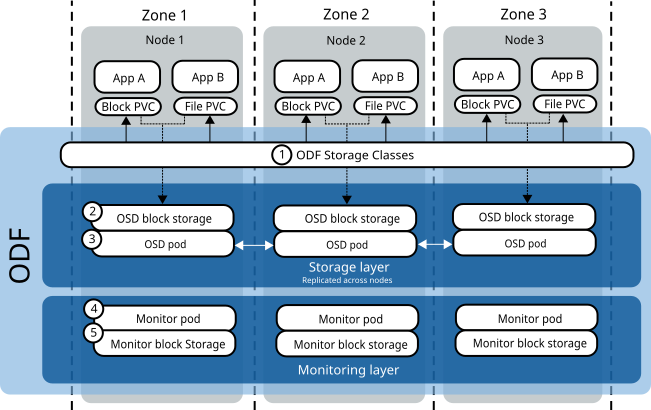

---
copyright:
  years: 2025
lastupdated: "2025-11-20"

subcollection:

keywords:
---

{{site.data.keyword.attribute-definition-list}}

# Storage design
{: #storage-design}

The following provides an in-depth view of the different storage types and solutions that are available. This document uses the e-commerce HomeDIY Ltd use case to make an architecture decision.

## Storage types
{: #storage-types}

### IBM Cloud Block Storage
{: #block-storage-types}

IBM Cloud Block Storage on Kubernetes offers persistent storage for containerized applications, ensuring data durability and scalability. It seamlessly integrates with Kubernetes clusters, providing dynamic provisioning, snapshots, and encryption. This enables efficient management and utilization of storage resources within the Kubernetes environment, enhancing application performance and reliability. For more information, see [Block Storage for VPC documentation](/docs/openshift?topic=openshift-vpc-block).

Review the following use cases for IBM Cloud Block Storage:

* Stateful Applications: The IBM Cloud Block Storage is ideal for deploying stateful applications like databases (for example, MySQL, PostgreSQL) in Kubernetes clusters.
* Data Analytics Workloads: When running data analytics workloads, you often need to process and store large volumes of data.

### IBM Cloud Object Storage
{: #object-stoage-types}

IBM Cloud's Object Storage plug-in optimizes Kubernetes for seamless data management with IBM Cloud Object Storage. Using IBM's robust storage service, it simplifies integration with cloud-native apps, offering distributed, geo-redundant storage. This pattern caters efficiently to diverse Kubernetes storage needs, enabling effortless provisioning, management, and dynamic resource allocation, streamlining administration. This type of storage volume is not suitable for write-intensive workloads, random write operations, incremental data updates, or transaction databases. For more information surrounding IBM Cloud Object Storage, see the following [Setting up IBM Cloud Object Storage](/docs/openshift?topic=openshift-storage-cos-understand).

Review the following use cases for IBM Cloud Object Storage:

* Data Backup and Archival: IBM Cloud Object Storage facilitates data backup and archival, crucial for scenarios like Kubernetes-based e-commerce apps. Automated backups ensure data durability and quick recovery.
* Media Storage for Content Delivery: Content delivery applications, such as video streaming platforms, require efficient and scalable media storage. With the IBM Cloud Object Storage pattern, you can store media assets like videos, images, and audio files. When a user requests media content, Kubernetes can retrieve it from IBM Cloud Object Storage and deliver it seamlessly to the user, ensuring a smooth streaming experience.
* Cross-Region Data Replication: IBM Cloud Object Storage supports cross-region data replication, essential for global businesses ensuring data redundancy and disaster recovery. Data synchronization between Kubernetes clusters minimizes downtime if there are regional failures.

### IBM Cloud Databases
{: #database-types}

IBM Cloud Databases simplify storage deployment on IBM Cloud Red Hat OpenShift environment, that uses its services for seamless experiences in provisioning, scaling, and maintenance. Supporting PostgreSQL, MySQL, Redis, and MongoDB, it offers automated backups, high availability, and security, enabling focus on applications rather than infrastructure. For more information, see [IBM Cloud Database Services](https://www.ibm.com/cloud/databases){: external}.

Review the following use cases for IBM Cloud Databases:

* Microservices Applications: IBM Cloud Databases suits microservice apps, providing isolated databases for each microservice. For instance, in e-commerce, deploy separate PostgreSQL databases for user accounts, products, and orders, ensuring data isolation, scalability, and fault tolerance.
* Scalable Web Applications:  IBM Cloud Databases automatically scale for variable web app traffic. For example, during flash sales, Kubernetes scales the database to handle increased traffic.

## Software-defined storage (SDS) solution
{: #sds-solution}

### Red Hat OpenShift Data Foundation
{: #openshift-types}

Red Hat OpenShift Data Foundation (ODF) is a **software-defined storage solution** designed to provide **persistent, scalable, and highly available storage** for containerized applications running on Red Hat OpenShift. It enables organizations to manage data seamlessly across hybrid and multi-cloud environments, ensuring performance, resilience, and security for modern workloads. For more information, see [Red Hat OpenShift Data Foundation](/docs/openshift?topic=openshift-ocs-storage-prep).

#### Key Features
{: #odf-key-features}

* **Unified Storage Platform:** Supports block, file, and object storage for diverse application needs.
* **Scalability & High Availability:** Built on Ceph technology to deliver elastic scaling and fault tolerance.
* **Integrated with OpenShift:** Provides native integration for Kubernetes-based deployments.
* **Data Services:** Includes features like encryption, compression, and replication for enterprise-grade reliability.
* **Hybrid Cloud Ready:** Enables data mobility across on-premises and cloud environments.

#### Architecture
{: #odf-architecture}

{: caption="Reference architecture for Red Hat OpenShift Data Foundation" caption-side="bottom"}

1. **OpenShift Data Foundation storage classes:** When you deploy ODF, the ODF operator creates File, Block, and Object storage classes in your cluster. Reference these storage classes in your PVCs and to claim storage for your apps.
2. **OSD Block Storage:** These devices provide application storage in your cluster. Each OSD is a raw block storage device that can be a local disk on your worker node or dynamically provisioned when you deploy ODF. In VPC clusters, your OSD block storage devices are dynamically provisioned by using the Block Storage for VPC driver. In Satellite clusters, you can use local volumes on your worker nodes, or dynamically provision block storage devices by using a block storage driver that supports dynamic provisioning. In Classic clusters, the OSD block devices are local disks on your worker nodes. When you deploy ODF, each device is mounted by an OSD pod. The total storage that is available to your applications is equal to the `osdSize` multiplied by the `numOfOsd`.
3. **Object Storage Daemon (OSD) pods:** The OSD pods manage data placement and replication across your storage devices.
4. **Monitor (Mon) pods:** The Monitor pods keep a map of your OpenShift Data Foundation storage cluster and monitor storage cluster health.
5. **Monitor (Mon) block storage device:** The monitor storage devices are the underlying storage devices for the monitor pods. Each monitor device is a raw block storage device that can be a local disk on your worker node or dynamically provisioned when you deploy ODF. Each device provides storage to a monitor pod.

Deploying Red Hat OpenShift Data Foundation for VPC ROKS cluster in IBM Cloud refer this [link](/docs/pattern-webapp-openshift-vpc?topic=pattern-webapp-openshift-vpc-compute-design)
{: note}

#### Use cases
{: #odf-use-cases}

#### **1. Database Storage**
{: #odf-database}

Enterprises running databases like **PostgreSQL** or **MongoDB** on Kubernetes can leverage **Red Hat OpenShift Data Foundation** for **high-performance, resilient, and persistent storage** . For example, a financial services company can use ODF to ensure their database workloads remain **highly available** and can **scale up or down on demand** without any risk of data loss.

#### **2. Hybrid and Multi-Cloud Deployments**
{: #odf-multi-cloud}

Organizations can use **OpenShift Data Foundation** to enable **consistent and secure data access** across hybrid and multi-cloud environments. For instance, a retail company deploying Kubernetes clusters in **IBM Cloud** and another cloud provider can rely on ODF for **seamless data mobility** , ensuring operational continuity across platforms.

#### **3. Disaster Recovery**
{: #odf-dr}

ODF supports **efficient disaster recovery strategies** by replicating data across multiple clusters or regions. An e-commerce platform can use ODF to ensure that, in the event of a regional outage, services remain **uninterrupted** , safeguarding customer experience and business continuity.
